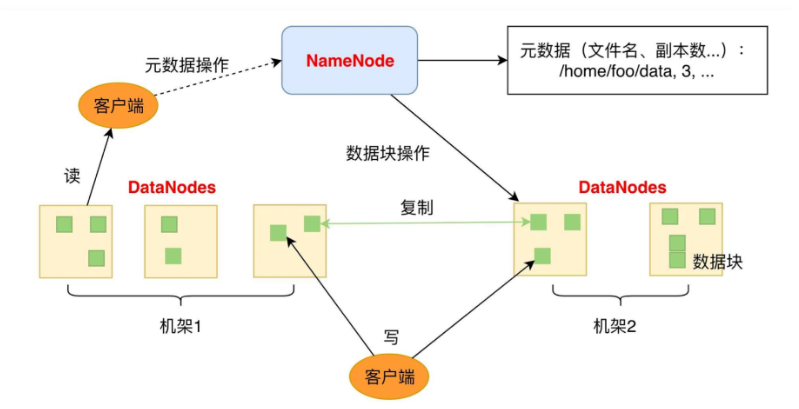
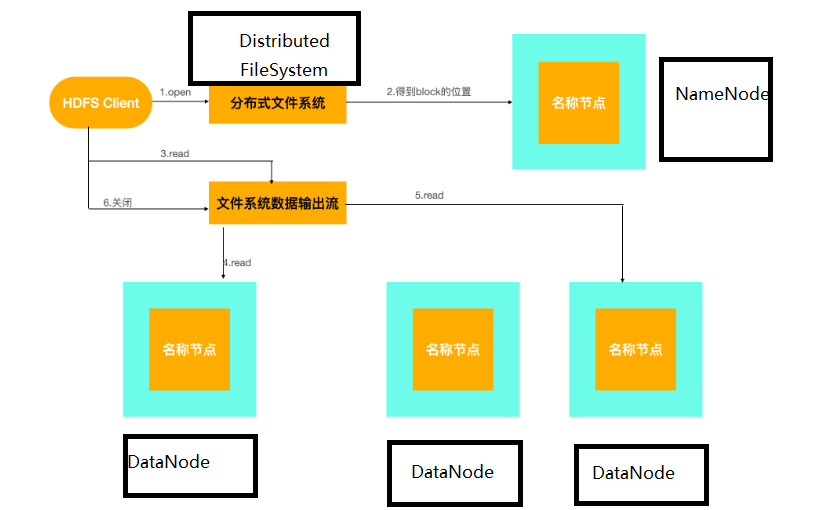
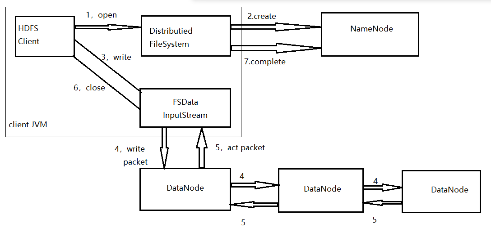

# HDFS笔记

## HDFS的概念

​	hdfs是hadoop技术框架中的分布式文件系统。允许将用户数据以文件的形式存储，并对外开放这些文件的命名空间。其内部机制是一个文件分割成一个或者多个默认大小为64M的数据块，并将这些数据块存储在一组DataNode中

## HDFS的原理

### 1.HDFS的体系结构

​	HDFS体系结构中有两类节点，一类是NameNode（元数据节点）；另一类是DataNode（数据节点）。

​	HDFS就像传统的文件系统一样，可以通过目录路径对文件执行CRUD（增、删、改、查）操作。由于分布式存储的特性，HDFS拥有一个NameNode和一些DataNode。NameNode管理文件系统的元数据，DataNode存储实际的数据，而客户端通过NameNode和DataNode的交互来访问文件系统。

​	客户端访问一个文件过程：

​		首先，客户端从NameNode中获取组成该文件数据块的位置列表，即数据块被存储在哪些DataNode上；然后，客户端直接从DataNode上读取文件数据。在此过程中，NameNode并不参与文件的传输。

​			

### 2.HDFS主要组件

 1. 数据块

    hdfs默认的最基本存储单位是64M的数据块

 2. NameNode和DataNode

    ​	NameNode管理文件系统的命名空间，它将所有文件和文件夹的元数据保存在一个文件系统树中。这些元数据主要包含edits和fsimage两类文件，fsimage是截止到自身被创建为止的HDFS的最新状态；而edits是自fsimage创建后的文件系统操作日志。NameNode每次启动的时候，都要合并这两类文件，按照edits的记录把fsimage更新到最新。

    ​	DataNode是文件系统中真正存储数据的地方。客户端或者NameNode可以向DataNode请求写入或读出数据块；DataNode则周期性地向NameNode汇报其存储的数据块信息。

    ​	客户端通过NameNode的引导来获取最合适的DataNode地址，然后直接连接DataNode读取数据。

 3. SecondaryNameNode（从元数据节点）

    ​	SecondaryNameNode并不是HDFS的第二个NameNode，它并不提供NameNode服务，而是NameNode的一个工具，用于帮助NameNode管理元数据。

    ​	SecondaryNameNode会定期从NameNode上获取元数据。当准备获取元数据的时候，它会通知NameNode暂停写入edits文件，NameNode收到请求后，会停止写入edits文件，并将之后的log记录写入一个名为edits.new的文件。SecondaryNameNode获取元数据后，将edits文件和fsimage文件再本机上进行合并，创建出一个新的fsimage文件，然后把新的fsimage文件发回NameNode。NameNode收到fsimage文件覆盖掉原来的fsimage文件，并删除edits文件，将新的edits.new文件重命名为edits。即上述操作避免了NameNode的edits日志的无线增长，从而加速NameNode启动过程。

 4. BackupNode（元数据备份）

 5. JournalNode

    ​	hadoop中的两个NameNode为了同步数据会通过一组称为JournalNodes的独立进程相互通信：当active状态的NameNode的命名空间发生改变时，会告知大部分的JournalNodes进程；而standby状态的NameNode则会读取JournalNodes中的变更信息，同时一直监控edit log的变化，并将变化应用于自己的命名空间，确保在集群出错时，命名空间状态已经完全同步了

### 3.HDFS中的文件读/写

#### 1.HDFS读数据

​	读数据过程如下:

 1. 客户端通过调用FileSystem对象中open()方法来打开需要读取的文件

 2. DistributedFileSystem对象通过RPC协议，调用NameNode来确定请求文件所在的位置

 3. DFSInputStream对象中包含文件开始部分数据块所在的DataNode地址，它首先会连接离客户端最近的一个存储数据块的DataNode，随后在数据流中重复调用read()方法，直到这个块完全读完为止

 4. 当第一个块读取完毕时，DFSInputStream会关闭连接，并查找下一个距客户端最近的存储数据块的DataNode

 5. 客户端按照DFSInputStream打开连接和DataNode返回数据流的顺序读取该块，并会调用NameNode来检索下一组所在的DataNode的位置信息

 6. 当完成所有文件的读取时，客户端需要调用DFSInputStream中的close()方法来释放资源

    

    #### 2.HDFS写数据

    1. 客户端调用DistributedFileSystem对象中的create()方法，创建一个文件
    2. DistributedFileSystem通过RPC协议，在NameNode的文件系统命名空间中创造一个新的文件，此时没有与DataNode关联
    3. NameNode会进行多重验证，以确保新建文件不在文件系统中，并确保发出请求的客户端拥有创建文件的权限。当所有验证通过时，NameNode会创建一个新文件的记录，如果创建失败，则会抛出异常；如果成功，则DistributedFileSystem会返回一个FSDataOutputStream用于给客户端写数据。这里的FSDataOutputStream和读取数据时的FSDataInputStream一样，都包含一个数据流对象DFSInputStream，客户端将使用它来处理NameNode和DataNode之间的通信
    4. 当客户端写入数据时，DFSOutputStream会将文件分割成包，然后放入一个内部队列（DataStreamer），其作用是将这些文件包放入数据流中，并请求NameNode为新的文件包分配合适的DataNode存放副本，返回的DataNode列表会形成一个管道
    5. DataStreamer将文件包以流的方式依次传送给管道中的DataNode。在DataStreamer传送文件的同时，DFSOutputStream也会保存一个内部的文件包队列，用于等待管道中的DataNode返回确认信息，这个队列称之为确认队列。只有当管道中的所有DataNode都返回了文件包写入成功的信息，DFSOutputStream才会将该包从确认队列中删除
    6. 客户端成功完成数据写入操作后，需要调用close()方法关闭数据流
    7. 客户端通知NameNode写入成功

    

    