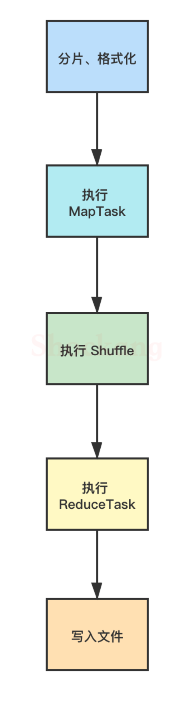
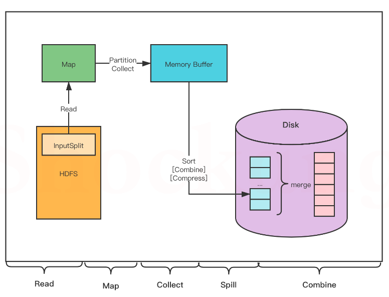
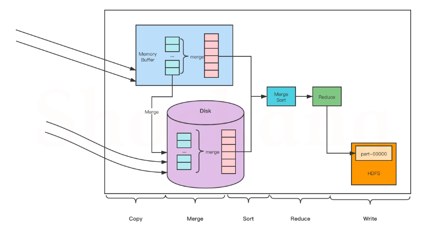

# MapReduce笔记

## MapReduce执行过程

​	MapReduce的工作流程大致分为5步

### 分片、格式化数据源

​	输入map端的数据源，必须经过分片和格式化操作

- 分片操作：指的是将原文件划分为大小相等的数据块（128MB），也就是分片（spilt），hadoop会为每个分片构建一个map任务，并由该任务运行自定义的map()函数，从而处理分片里的每一条记录
- 格式化操作：将划分好的分片格式化为键值对<key,value>形式的数据，其中，key代表偏移量，value代表每一行内容

### 执行maptask

​	每个map任务都有一个内存缓冲池（缓冲区大小100MB），输入的分片（spilt）数据经过map任务处理后的中间结果会写入内存缓冲池中。

如果写入的数据达到内存缓冲的阈值（80MB），会启动一个线程将内存中的溢出数据写入磁盘，同时不影响map中间结果继续写入缓冲区。

在溢写过程中，MapReduce会对key进行排序，如果中间结果比较大，会形成多个溢写文件，最后的缓冲区数据也会全部溢写入磁盘形成一个溢写文件，如果是多个溢写文件，则最后合并所有的溢写文件为一个文件。

1. read阶段：maptask通过用户编写的recordreader，从输入的InputSpilt中解析出一个个key/value

2. map阶段：将解析出的key/value交给用户编写的map()函数处理，并产生一系列新的key/value

3. collect阶段：在用户编写的map()函数中，数据处理完成后，一般会调用outputCollector.collect()输出结果，在该函数内部，它将生成的key/value分片(通过调用partitioner)，并写入一个唤醒内存缓冲区（默认为100MB）

4. Spill阶段：即溢写，当缓冲区快要溢出时（默认为缓冲区大小的80%），会在本地文件系统创建一个溢写文件，将该缓冲区的数据写入这个文件

   > 将数据写入本地磁盘前，先要对数据进行一次本地排序，并在必要时对数据进行合并、压缩等造作。
   >
   > 写入磁盘之前，线程会根据reducetask的数量，将数据分区，一个reduce任务对用一个分区的数据。
   >
   > 这样做的目的是为了避免有些reduce任务分配到大量数据，而有些reduce任务分到很少的数据，甚至没有分到数据的尴尬局面
   >
   > 如果此时设置了Combiner，将排序后的结果进行Combine操作，这样做的目的是尽可能少地执行数据写入磁盘的操作

5. Combine阶段：当所有数据处理完成后，maptask会对所有临时文件进行一次合并（会不断进行排序），以确保最终只会生成一个已分区已排序数据文件

### 执行shuffle过程

​	MapReduce工作过程中，map阶段处理的数据如何传递给reduce阶段，这是MapReduce框架中关键的一个过程，这个过程叫做shuffle。

​	shuffle会将maptask输出的处理结果数据分发给reducetask，并在分发的过程中，对数据按key进行分区和排序

### 执行reducetask

​	输入reducetask的数据流是<key,{value list}>形式，用户可以自定义reduce()方法进行逻辑处理，最终以<key,value>的形式输出

1. Copy阶段：reduce会从各个maptask上远程复制一片数据（每个maptask传来的数据都是有序的），并针对某一片数据，如果其大小超过一定的阈值，则写在磁盘上，否则直接放在内存中
2. Merge阶段：在远程复制数据的同时，reducetask会启动两个后台线程，分别对内存和磁盘上的文件进行合并，以防止内存使用过多或者磁盘文件过多
3. Sort阶段：用户编写reduce()方法输入数据是按key进行聚集的一组数据
4. Reduce阶段：对排序后的键值对调用reduce()方法，键相等的键值对调用一次reduce()方法，每次调用会产生零个或多个键值对，最后把这些输出的键值对写入到HDFS中
5. Write阶段：reduce()函数将计算结果写到HDFS上

### 写入文件

​	MapReduce框架会自动把reducetask生成的<key,value>传入OutputFormat的write方法，实现文件的写入操作

