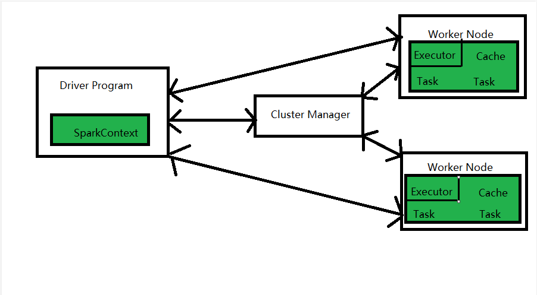

# Spark笔记

### 1.Spark是什么

Spark是一个开源的通用的分布式并行计算框架（大数据计算引擎）。

Spark基于map reduce算法实现的分布式计算，拥有MapReduce所具有的优点；但不同于MapReduce的是Job中间输出和结果可以保存在内存中，从而不再需要读写HDFS。因此Spark能更好地适用于数据挖掘与机器学习等需要迭代的map reduce的算法。

Spark是基于内存计算的框架，计算速度非常之快，但是它仅仅只是涉及到计算，并没有涉及到数据的存储，后期需要使用Spark对接外部的数据。

### 2.Spark的四大特性

#### Simple（易用性）

Spark提供了丰富的高级运算操作，支持丰富的算子，并支持Java。Python？Scala、R、SQL等语言的API，使用户可以快速构建不同的应用。

开发人员只需要调用Spark封装好的API来实现即可，无需关注Spark的底层架构。

#### Fast（速度快）

Spark将处理的每个任务都构造成一个DAG（有向无环图）来执行，实现原理是基于RDD（弹性分布式数据集）在内存中对数据进行迭代计算，以实现批量和流式数据的高性能快速计算处理

> **Spark比MapReduce速度快的原因**
>
> - 基于内存
>
>   MapReduce任务后期再计算的时候，每一个job的输出结果会落地到磁盘，后续有其他的job需要依赖于前面job的输出结果，这个时候需要进行大量磁盘io操作，性能上就比较低
>
>   Spark任务后期再计算的时候，job的输出结果可以保存在内存中，后续有其他的job需要依赖于前面job的输出结果，这个时候就直接从内存中获取得到，避免了磁盘的io操作，性能比较高
>
>   对于Spark和MapReduce都会产生shuffle阶段，在shuffle阶段中产生的数据都会落地到磁盘
>
> - 进程与线程
>
>   MapReduce任务以进程的方式运行在yarn集群中，比如程序中有100个MapTask，一个task就需要一个进程，这些task要运行就需要开启100个进程。
>
>   Spark任务以线程的方式运行在进程中，比如程序中有100个MapTask，后期一个task就对应一个线程，这里不再是进程。
>
>   进程可以启动很多线程，而开启一个进程与开启一个线程需要的时间和调度代价是不一样的。开启一个进程需要的时间远远大于一个进程
>
>   

#### Unified（通用性）

Spark提供了一站式的统一解决方案，可用于批处理、交互式查询。实时流处理、机器学习和图运算等。这些不同类型的处理都可以在同一个应用中无缝组合使用

#### Scalable（兼容性）

Spark可以非常方便地与其他开源产品进行融合

### 3.Spark运行原理

#### Spark运行模式

| 运行模式   | 运行类型 | 说明                                                         |
| ---------- | -------- | ------------------------------------------------------------ |
| Local      | 本地模式 | 常用于本地开发，分为Local单线程和Local-Cluster多线程模式     |
| Standalone | 集群模式 | 独立模式，在Spark自己的资源调度管理框架上运行，该框架采用master/salve结构 |
| on yarn    | 集群模式 | 用于生产环境，在yarn资源管理器框架上运行，由yarn负责资源调度，Spark负责任务调度和计算 |
| on Mesos   | 集群模式 | 用于生产环境，在Mesos资源管理器框架上运行，由Mesos负责资源调度，Spark负责任务调度和计算 |
| on cloud   | 集群模式 | 运行在AWS、阿里云等环境                                      |

#### Spark集群架构

1. Cluster Manager

   Cluster Manager是Spark的集群资源管理器，存在于Master进程中，主要用于对整个集群资源进行管理和分配，根据其部署模式的不同，可以分为Local、Standalone、yarn、Mesos、Cloud等模式

2. Driver

   执行客户端写好的main方法，它构建一个名为SparkContext对象，该对象是所有Spark程序的执行入口

3. Worker

   Spark工作节点，用于执行提交任务，其主要的工作职责有以下几点：

   - Worker节点通过注册机向Cluster Manager汇报自身的CPU、内存等资源使用信息
   - Worker节点在Spark Master的指示下，创建并启用Executor（真正的计算单元）
   - Spark Master将资源和Task分配给Worker节点上的Executor并执行运用
   - Worker节点同步Executor状态和资源信息给Cluster Manger

4. Executor

   它是一个进程，它会在Worker节点启动该进程，一个Worker节点可以有多个Executor进程

5. Task

   Spark任务是以Task线程的方式运行在Worker节点对应的Executor进程中

6. Application

   Application是基于Spark API编写的应用程序，包括实现Driver功能的代码和集群中各个Executor上要执行的代码

#### 执行过程：

​	在集群模式下，Spark的应用程序会由一组相互独立的进程并行执行。这组进程由Driver中的SparkContext对象统一协调

​	当应用程序被提交到Spark集群时，SparkContext会与集群管理器通信，集群管理器会创建作业调度模块和任务调度模块，集群的资源管理器则负责向应用程序分配资源

​	作业调度模块会将作业分解为Stage，并决定如何分配任务，然后将分配方式连同相同的任务传递给其所属的下级任务调度模块

​	与此同时，Spark会在集群的各个Worker节点上创建Executor进程，同时Driver会将代码发送到Executor中

​	最后，SparkContext会把任务（Task）发送到Executor中执行，任务执行完成后，Executor会向SparkContext返回信息并释放资源

​	在任务执行过程中，Driver会监控Executor的心跳，集群管理器会根据Driver的监控信息，向活动的Executor分配任务。当作业调度模块发现shuffle数据存在异常时，会重新运行之前的Stage，任务调度模块则会始终维护所有任务的运行状态，如果任务失败，任务调度模块会重新启动任务

#### Spark调度系统

Spark调度系统主要由DAGScheduler和TaskScheduler组成

- DAGScheduler：负责创建job，把一个job根据RDD间的依赖关系，划分到不同Stage中，并将划分后的每个Stage都抽象为一个或多个Task组成的TaskSet，批量提交给TaskScheduler来进行进一步的任务调度。

- TaskScheduler：负责按照调度算法对每个具体的Task进行批量调度执行，协调物理资源，跟踪并获取状态结果

  主要调度算法有FIFO、FAIR。

  > FIFO算法：先进先出，Spark默认的调度模式
  >
  > FAIR算法：支持将作业分组到池中，并为每个池设置不同的调度权重，任务可以按照权重来决定执行顺序

#### 核心组件

Spark基于Spark Core扩展了四个核心组件，分别用于满足不同领域的计算需求

##### 1.Spark Core

​	Spark Core是Spark的核心模块，负责调度和管理在集群上运行的分布式计算任务。Spark Core包含两个主要功能：一是负责Spark任务调度、内存管理、错误恢复以及与存储系统的交互等；二是负责RDD的封装，提供了创建和操作RDD的API

##### 2.Spark SQL

​	Spark SQL提供了面向结构化数据的Sql查询接口，使用户可以使用SQL或基于Apache hive的hiveSQL来方便地进行数据处理。Spark SQL支持包括HIve表、Parquet以及JSON等多种形式的数据源，同时还提供在RDD中使用SQL的接口，使开发者能高效地将SQL与更加复杂的数据处理逻辑整合在同一应用中

##### 3.Spark Steaming

​	Spark Streaming是Spark提供的流式计算组件，该组件与RDD API高度集成，可以帮助开发人员高效地处理数据流的数据

##### 4.MLlib

​	MLlib提供了常用的机器学习工具库，其中集成了诸如分类、回归、聚类、协同过滤等常用的机器学习算法，同时还提供了数据导入、模型评估等支持功能

##### 5.GraphX

​	GraphX是Spark针对图处理所设计的工具库，可以方便地进行并行化的图运算