# Hive笔记

## hive概述、

1.hive是建立在hadoop框架之上的一个==数据仓库工具==，所有数据存储在hdfs或者hbase。它在内部实现了一个SQL语言编辑器，并对外实现接口。当hive获取用户指令后，会将指令中的SQL语言解析为一个MapReduce可执行计划，并按此计划将MapReduce任务交给hadoop集群，最后将结果返回给用户

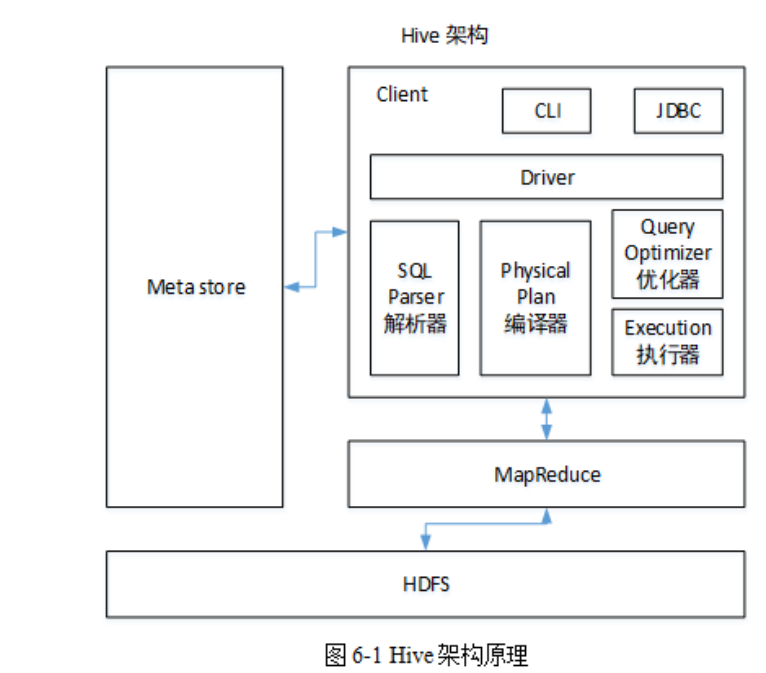

2.hive提供了一系列的工具，可以用来进行==数据提取，转化，加载（ETL）==,这是一种可以存储、查询和分析存储在hadoop中的大规模数据的机制，本质上是一种大数据离线分析工具

## hive数据模型

1.元数据（Metastore）

hive中的元数据包括表的名字，表的列和分区及其属性，表的属性（是否为外部表等），表的数据所在目录等。hive的元数据经常面临读取、修改和更新操作，因此不适合存储在hdfs上，而是通常存储在关系型数据库，如mysql，Derby

2.数据单元

（1）数据库：hive中的数据库并非真实存在，而是相当于一个命名空间

（2）表：

​         ==内部表（默认）==：默认情况下会将这些表的数据存储在由配置项   hive.metastore.warehouse.dir所定义的目录的子目录下。当我们删除一个内部表时，hive也会删除表中的数据，内部表不适合和其他工具共享数据

​	   ==外部表==：外部表的创建时需指向数据存储器中已经存在的数据，它和内部表在元数据的存储上是相同的，但在实际数据的存储上存在一定的差异。首先，由于数据已经存在，所以外部表在被创建时，表的创建和数据的加载是同时完成的；其次，外部表的实际数据始终保存在数据存储器中，而不会被移动到数据仓库的数据目录中；最后，当外部表被删除时，只有元数据会被删除，数据存储器中的实际数据不会被删除。

（3）分区：每个表会被分割至少一个分区。分区用于将表中的数据存储在表所在目录下的相应的子目录中

（4）桶或簇：每个分区会基于表的某列数据的哈希值被分化为若干个桶，每个桶对应分区下的一个数据文件

3.基本数据类型

整型、布尔型、浮点型、定点型、字符串、日期和时间、二进制

4.复杂数据类型

（1）结构体

（2）键值对

（3）数组

## 用户接口

> CLI：命令行客户端，最常用的方式
>
> hiveserver2：支持多客户端并发认证，为开放的API客户端（如JDBC、ODBC等）提供了更好的支持。hiveserver2还允许客户端不启动CLI的情况下对hive中的数据操作，但需启动hiveserver2，是程序开发过程中最为常用的hive数据访问服务
>
> web UI：比较麻烦，基本不用

## 执行流程

1.通过客户端提交一条HQL语句

2.通过driver发送到complier对HQL进行词法分析、语法分析，在这一步，编译器要知道此HQL语句到底操作哪张表

3.去元数据库找到表信息

4.compiler编译器提交HQL语句分析方案

5.executor执行器收到方案后，执行方案（DDL过程）。在这里注意，执行器在执行方案时，会判断：

（1）如果当前方案不涉及到MR组件，比如为表添加分区信息，字符串操作等，比如简单的查询操作等，此时就会直接和元数据库交互，然后去HDFS上去找具体数据

（2）如果方案需要转换成MR job，则会将job提交给hadoop

6.MR job完成，并且将运行结果写入到HDFS上

7.执行器和HDFS交互，获取结果文件信息

## DDL和DML操作

### DDL数据定义

#### 4.1创建数据库

- 创建一个数据库，数据库在hdfs上默认存储地址为/user/hive/warehouse/*.db

  ```hive
  hive(default)> create database db_hive;
  hive(default)> create database if not exists db_hive;
  ```

- 创建一个数据库指定数据库在hdfs上存放的位置

  ```hive
  hive(default)> create database db_hive2 location '/db_hive2.db';
  ```

#### 4.2查询数据库

##### 4.2.1显示数据库

```hive
hive(default)> show databases;
hive(default)> show databases like 'db_hive';  //过滤显示查询的数据库
hive(default)> desc database db_hive;  //显示数据库信息
hive(default)> desc database extended db_hive;  //显示数据库详细信息
hive(default)> use db_hive;  //切换当前数据库
```

##### 4.2.2修改数据库

```hive
hive(default)> alter database db_hive set dbproperties('createtime'='20230202');
```

##### 4.2.3删除数据库

```hive
hive(default)> drop database if exists db_hive2;  //当数据库不存在时，忽略本次操作，不抛出异常
hive(default)> drop database db_hive2 cascade;  //删除非空库，强制删除

```

#### 4.3创建表

- 建表语法

  ==create [external] table [if not exists] table_name==

  ==[(col_name data_type[comment col_comment],...)]==

  [comment table_comment]

  ==[partitioned by (col_name data_type[comment col_comment],...)]==

  [clustered by (col_name,col_name,...)]

  [sorted by (col_name) [asc|desc],...] into num_buckets buckets

  ==[row format row_format]==

  [stored as file_format]

  ==[location hdfs_path]==

- 字段说明

  1. create table创建一个指定名字的表。如果相同名字的表已经存在，则抛出异常；用户可以用if not exists选项忽略这个异常
  2. external 关键字可以让用户创建一个外部表，在建表的同时指定一个实际数据的路径（location），==hive创建内部表时，会将数据移动到数据仓库指定的路径；若创建外部表，仅记录数据所在的路径，不对数据的位置做任何改变==，在删除表的时候，内部表的元数据和数据会被一起删除，而外部表只删除元数据，不删除数据
  3. comment：为表和列添加注释
  4. ==partitioned by：创建分区表==
  5. clustered by：创建分桶表
  6. sorted by 不常用
  7. row format 用户在建表的时候可以自定义SerDe或者使用自带的SerDe，目的是用于序列化和反序列化
  8. stored as指定存储文件类型 ：常用的存储的文件类型：sequencefile（二进制序列文件）、textfile（文本文件）、rcfile（列式存储格式文件）
  9. ==location ：指定表在hdfs上的存储位置==
  10. like 允许用户复制现有的表结构，但是不复制数据
  
- 内部表

  1. 理论

     默认创建的表是内部表，因为这种表hive会控制着生数据命周期。hive默认情况下会将这些表的数据存储在由配置项hive.metastore.warehouse.dir所定义的目录的子目录下。当我们删除一个内部表时，hive也会删除这个表中的数据，管理表不适合和其他工具共享数据

  2. 案列实操

     (1)普通创建表

     ```hive
     hive(default)> create table if not exists student(id int,name string)row format delimited fields terminated by '\t' stored as textfile location '/user/hive/warehouse/student';
     ```

     (2)根据查询结果创建表

     ```hive
     hive(default)> create table if not exists student2 as select id,name from student;
     ```

     (3)根据已经存在的表结构创建表

     ```hive
     hive(default)> create table if not exists student3 like student;
     ```

     (4)查询表的类型

     ```hive
     hive(default)> desc formatted student;
     ```

- 外部表

  1. 理论

     表是外部表，所以hive并不认为其完全拥有这份数据。删除该表并不会删除这份数据，不过描述表的元数据信息会被删除

  2. 案列实操

     （1）创建部门表

     ```hive
     hive(default)> create external table if not exists dept(deptno int,dname string,loc int)row format delimited fields terminated by '\t';
     ```

       (2)向外部表导入数据

     ```hive
     hive(default)> load data local inpath '/opt/module/data/dept.txt' into table dept;
     ```

       (3)内部表与外部表之间的转换

     ```hive
     hive(default)> alter table student set tblproperties('EXTERNAL'='TRUE');   //修改为外部表
     hive(default)> alter table student set tblproperties('EXTERNAL'='FALSE');  //修改为内部表
     ```

     注意：（'EXTERNAL'='TRUE'）('EXTERNAL'='FALSE')为固定写法，区分大小写！

- 分区表

  分区表实际上就是对应一个hdfs文件系统上的独立文件夹，该文件夹是该 分区所有数据文件。hive中的分区就是分目录，把一个大的数据集根据业务需要分割成小的数据集。在查询时通过where子句中的表达式选择查询所需要的指定的分区，这样的查询效率会提高很多。

  1. 分区表的基本操作

     （1）创建分区表

     ```hive
     hive(default)> create table dept_partition(depno int,dname string,loc string)partitioned by (month string)row format delimited fields terminated by '\t';
     ```

     （2）加载数据到分区表

     ```hive
     hive(default)> load data local inpath '/opt/module/data/dept.txt' into table dept_partiton partition(month='202302');
     hive(default)> load data local inpath '/opt/module/data/dept.txt' into table dept_partiton partition(month='202301');
     ```

     （3）查询分区表中的数据

     ```hive
     hive(default)> select * from dept_partition where month='202302';
     hive(default)> select * from dept_partition where month='202302'
     union
     select * from dept_partition where month='202301';  //多分区联合查询
     ```

     （4）增加分区

     ```hive
     hive(default)> alter table dept_partition add partition(month='202303');  //创建单个分区
     hive(default)> alter table dept_partition add partition(month='202304') partition(month='202305'); //创建多个分区（用空格隔开）
     ```

     （5）删除分区

     ```hive
     hive(default)> alter table dept_partition drop partition(month='202303');  //删除单个分区
     hive(default)> alter table dept_partition drop partition(month='202304')，partition(month='202305');  //删除多个分区（用逗号隔开）
     ```

     （6）查看分区表有多少分区

     ```hive
     hive(default)> show partitons dept_partition;
     ```

  2. 分区表注意事项

     （1）创建二级分区表

     ```hive
     hive(default)> create table dept_partition2(deptno int,dname string,loc string) partitioned by (month string,day string) row format delimited fields terminated by '\t';
     ```

     （2）加载数据到二级分区表

     ```hive
     hive(default)> load data local inpath '/opt/module/data/dept.txt' into table dept_partition2 partition(month='202302',day='03');
     ```

     （3）查看分区数据

     ```hive
     hive(default)> select * from dept_partition2 where month='202302' and day='03';
     ```
  
  3. 动态分区
  
     关系型数据库中，对分区表insert数据时候，数据库自动会根据分区字段的值，将数据插入到相应的分区中，hive中也提供了类似的机制，即动态分区，只不过，使用动态分区，需要进行相应的配置
  
     （1）开启动态分区功能（默认true）
  
     ```hive
     hive.exec.dynamic.partition=true
     ```
  
     （2）设置非严格模式
  
     ```hive
     hive.exec.dynamic.partition.mode=nonstrict
     ```
  
     （3）设置动态分区
  
     ```hive
     set hive.exec.dynamic.partition.mode=nonstrict;
     hive (default)> insert into table                                                   dept_partition_dy partition(loc) 
                     select 
                     deptno, dname, loc 
                     from dept;
     ```
  
     注意：partition动态分区的字段通过查询表获取该字段（最后一个字段）

#### 4.4修改表

1. 重命名表

   ```hive
   hive(default)> alter table dept_partition2 rename to dept_partition3;
   ```

2. 增加、修改、替换列信息

   ```hive
   ALTER TABLE table_name CHANGE [COLUMN] col_old_name col_new_name column_type [COMMENT col_comment] [FIRST|AFTER column_name] //更新列
   ALTER TABLE table_name ADD|REPLACE COLUMNS (col_name data_type [COMMENT col_comment], ...)   //增加和替换列
   
   ```

   add是代表新增一字段，字段位置在所有列后面（partition列前），replace则是表示替换表中所有字段

3. 删除表

   ```hive
   hive(default)> drop table dept_partition;
   ```

### DML数据操作

#### 5.1数据导入

##### 5.1.1向表中导入数据

（1）加载本地文件到hive

```hive
hive (default)> load data local inpath '/opt/module/data/student.txt' into table default.student;
```

（2）加载hdfs文件到hive中

上传文件到hdfs

```hive
hive (default)> dfs -put /opt/module/data/student.txt /user/hive;
```

加载hdfs上的数据

```hive
hive (default)> load data inpath '/user/hive/student.txt' into table default.student;
```

（3）加载数据覆盖表中已有的数据

上传文件到hdfs

```hive
hive (default)> dfs -put /opt/module/data/student.txt /user/hive;
```

加载数据覆盖表中已有的数据

```hive
hive (default)> load data inpath '/user/hive/student.txt' 
overwrite into table default.student;
```

##### 5.1.2通过查询语句向表中插入数据（insert）

1. 创建一张表

   ```hive 
   hive (default)> create table student_par(id int, name string) row format delimited fields terminated by '\t';
   ```

2. 基本插入数据

   ```hive
   hive (default)> insert into table student_par values(1,'wangwu'),(2,'zhaoliu');
   ```

3. 基本模式插入（根据单张表查询结果）

   ```hive 
   hive (default)> insert overwrite table student_par select id,name from student where month='202302';
   ```

   insert into:已追加的方式插入到表或分区，原有数据不会删除

   insert overwrite:会覆盖表中原有的数据

   注：insert不支持插入部分字段

4. 多表（多分区）插入模式（根据多张表的查询结果）

   ```hive
   hive (default)> from student 
   insert overwrite table student partition(month='202302') 
   select id,name where month='202302'
   insert overwrite table student partition(month='202301')
   select id,name where month='202302';
   ```

##### 5.1.3查询语句中创建表并加载数据（as select）

```hive
hive (default)> create table if not exists student3 as select id,name from student;
```

##### 5.1.4创建表时通过location指定加载数据路径

1. 创建表，并指定在hdfs位置

```hive
hive (default)> create table if not exists student5(
 id int, name string
 )
 row format delimited fields terminated by '\t'
 location '/user/hive/warehouse/student5';
```

2. 上传数据到hdfs上

   ```hive
    hive (default)> dfs -put /opt/module/data/student.txt /user/hive/warehouse/student5;
   ```

##### 5.1.5 Import数据到指定hive表中

注意:先用export导出后，再将数据导入

```hive
hive (default)> import table student2 from '/user/hive/warehouse/export/student';
```

#### 5.2数据导出

##### 5.2.1 Insert导出

1. 将查询结果导出到本地

   ```hive
   hive (default)> insert overwrite local directory '/opt/module/hive/data/export/student' select * from student;
   ```

2. 将查询结果格式化导出到本地

   ```hive
   hive (default)> insert overwrite local directory '/opt/module/hive/data/export/student1' row format delimited fields terminated by '\t' select * from student;
   ```

3. 将查询结果导出到hdfs上（没有local）

   ```hive
   hive (default)> insert overwrite directory '/user/hive/student2' row format delimited fields terminated by '\t' select * from student;
   ```

##### 5.2.2hadoop命令导出到本地

```hive
hive (default)> dfs -get /user/hive/warehouse/student/student.txt
/opt/module/data/export/student3.txt;
```

##### 5.2.3hive shell 命令导出

基本语法：（hive -f/-e 执行语句或者脚本 >file）

```hive
[root@hadoop101 hive]$ bin/hive -e 'select * from default.student;' >
/opt/module/hive/data/export/student4.txt;
```

##### 5.2.4export导出到hdfs上

```hive
hive (default)> export table default.student to
'/user/hive/warehouse/export/student';
```

##### 5.2.5清除表中数据（truncate）

注：truncate只能删除内部表，不能删除外部表中数据

```hive
hive (default)> truncate table student;
```

## 查询

#### 基本查询

1. 全表查询

   ```hive
   hive (default)> select * from emp;
   hive (default)> select empno,ename,job,mgr,hiredate,sal,comm,deptno from 
   emp ;
   ```

2.  选定特定列查询

   ```hive
   hive (default)> select empno, ename from emp;
   ```

   注意：

   （1）SQL语言大小写不敏感

   （2）SQL可以写成一行或多行

   （3）关键字不能被缩写也不能分行

   （4）各子句一般要分行写

   （5）使用缩进提高语句的可读性（四个空格)

3. 列别名

   （1）重命名一个列

   （2）便于计算

   （3）紧跟列名，也可以在列名和别名之间加入关键字‘as’

   ```hive
   hive (default)> select ename AS name, 
                          deptno dn 
                   from emp;           
   ```

4. 算术运算符

   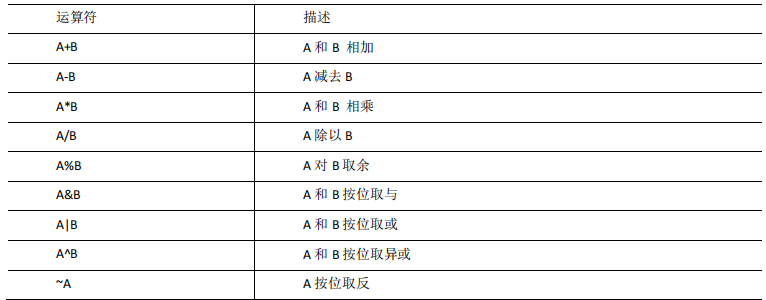

5. 常用函数

   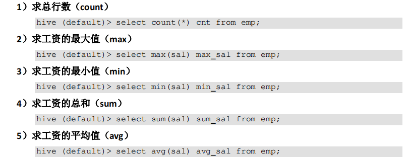

6. limit语句

   典型的查询会返回多行数据。limit子句用于限制返回的行数

7. where语句

   （1）使用where子句，将不满足条件的行过滤掉

   （2）where子句紧跟from子句

8. 比较运算符

   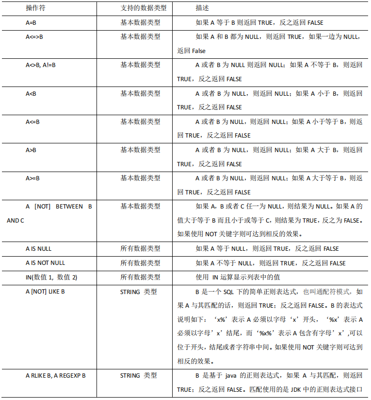

9. 逻辑运算符

   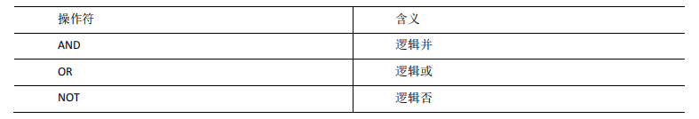

#### 分组

1. group by语句

   通常会和聚合函数一起使用，按照一个或者多个列队结果进行分组，然后对每个组执行聚合操作

2. 案列实操

   (1)计算emp表每个部门的平均工资

   ```hive
   hive (default)> select t.deptno,
                          avg(t.sal)
                   from emp t 
                   group by t.deptno;
   ```

   (2)计算emp表每个部门中每个岗位的最高薪水

   ```hive
   hive (default)> select t.deptno,
                          t.job,
                          max(t.sal)
                   from emp t
                   group by t.deptno,t.job;
   ```

3. having语句

   （1）having与where不同点

   ​			where后面不能写成分组函数，而having后面可以使用分组函数

   ​			having只用于group by分组统计语句

4. 补充

   > 1. from 和 joins
   >
   >    from或join会第一个执行，确定一个整体的数据范围。如果要join不同表，可能会生成一个临时table来用于执行下面的过程。总之第一步可以简单理解为确定一个数据源表（含临时表）
   >
   > 2. where
   >
   >    where语句就将在这个数据源中按要求进行数据筛选，并丢弃不符合要求的数据行，所有筛选col属性只能来自from圈定的表，as别名还不能在这个阶段使用，因为别名是一个还没执行的表达式
   >
   > 3. group by
   >
   >    如果你用了group by分组，那将对之前的数据进行分组，统计等，并将是结果缩小为分组数，这意味着其他数据在分组后丢弃
   >
   > 4. having
   >
   >    如果你用了group by分组，having会在分组完成后对结果再次筛选。as别名也不能在这个阶段使用
   >
   > 5. select
   >
   >    确定结果之后，select用来对结果col简单筛选或者计算，决定输出什么数据
   >
   > 6. distinc
   >
   >    如果数据行有重复distinct将负责排重
   >
   > 7. order by
   >
   >    在结果集确定的情况下，order by对结果做排序。因为select中的表达式已经执行完了。此时可以用别名
   >
   > 8. limit/offset
   >
   >    最后limit和offset从排序的结果中截取部分数据

#### join语句

1. inner join（内连接）

   ```hive
   select * from table_a a inner join table_b b on a.name=b.name;
   ```

   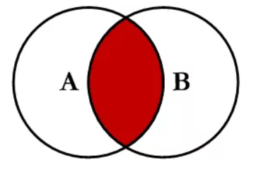

2. left join（左外连接）

   返回左表的全部数据，和右表中满足on条件的行，如果左表的行在右表中没有匹配的数据，那么这一行中右表对应的数据为null

   ```hive
   select * from table_a a left join table_b on a.name=b.name;
   ```

   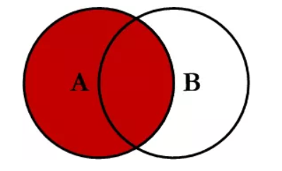

3. right join（右外连接）

   返回右表中所有行,和左表中满足on条件的行，如果右表的行在左表中没有匹配，那么这一行中左表的对应的数据为null

   ```hive
   select * from table_a a right join table_b b on a.name=b.name;
   ```

   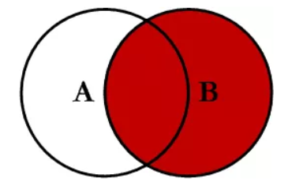

4. left join excluding inner join（左连接-内连接）

   就是在left join查询中加入一个where条件（b.name is null），过滤掉A,B表的交集，left join会返回左表的全部，右表中匹配的返回，不匹配的null值填充，本查询刚好过滤掉右表为null的记录

   ```hive
   select * from table_a a left join table_b b on a.name=b.name where b.name is null
   ```

   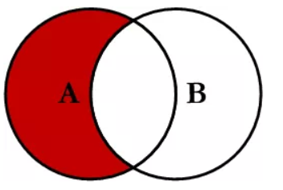

5. right join excluding inner join(右连接-内连接)

   就是在right join查询中加入一个where条件（a.name is null），过滤掉A,B表的交集。right join会返回右表的全部，左表中匹配的返回，不匹配的用null填充，本查询刚好过滤掉左表为null的记录

   ```hive 
   select * from table_a a right join table_b b on a.name=b.name where a.name is null;
   ```

   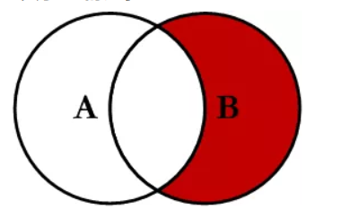

6. full outer join（外连接）

   会返回左表，右表所有的行，对应表中没有数据以null填充。由于MySQL数据库不支持full outer join，所以需要使用left join + right join来代替

   ```hive
   select * from table_a a left join table_b b on a.name=b.name
   union
   select * from table_a a right join table_b b a.name=b.name;
   ```

   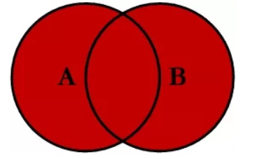

7. full outer join excluding inner join（外连接-内连接）

   ```hive
   select * from table_a a left table_b b on a.name=b.name where b.name is null
   union
   select * from table_a a right table_b b on a.name=b.name where a.name is null;
   ```

   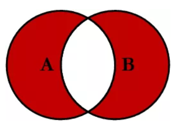

#### 排序

1. 使用order by子句排序

   asc：升序（默认）

   desc：降序

   ```hive
   hive (default)> select * from emp order by sal;
   hive (default)> select * from emp order by sal desc;  --降序
   ```

2. 按照别名排序

   按照员工薪水的2倍排序

   ```hive
   hive (default)> select ename,sal*2 doublesal from emp order by doublesal; 
   ```

3. 多个列排序

   按照部门和工资升序排序

   ```hive
   hive (default)> select ename,depno,sal from emp order by depno,sal;
   ```

4. 每个reduce内部排序（sort by）

   sort by：对于大规模的数据集order by的效率非常低。在多数情况下，并不需要全局排序，此时可以使用sort by，为每个reducer产生一个排序文件。每个reducer内部进行排序，对全局结果集来说不是排序

   （1）设置reduce个数

   ```hive
   hive (default)> set mapreduce.job.reduces=3;
   ```

   （2）查看reduce个数

   ```hive
   hive (default)> set mapreduce.job.reduces;
   ```

   （3）根据部门编号降序查看员工信息

   ```hive
   hive (default)> select * from emp sort by deptno desc;
   ```

## 函数

### 1.常用函数

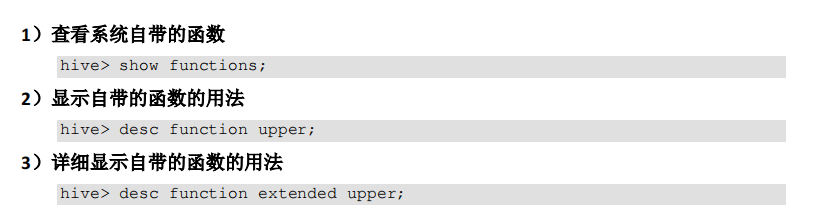

#### 1.1数学函数

​	数学函数是hive内部提供的专门用于数学运算的函数，如round（）函数和sqrt（）函数等

1. round()函数主要用于对给定的数字进行四舍五入取近似值
2. sqrt()函数表示对给定的数字去平方根

#### 1.2集合函数

​	集合函数是hive内部处理集合数据的函数，如size()函数和map_keys()函数。

	1. size()函数主要用于获取map或者数组的长度
	1. map_keys()函数主要用来获取map集合中所有的key

#### 1.3类型转换函数

​	类型函数能够将某些数据类型转换成便于查询或者计算统计的数据类型

 	1. cast()函数，其基本格式为cast(value as type)，能够将给定的数据value转化为type类型

#### 1.4日期函数

​	日期函数是一类专门处理日期数据的函数，能够方便地对日期数据进行转换和处理

1. unix_timestamp()函数，其能够方便地获取服务器的时间戳

   ```hive
   hive (default)> select unix_timestamp();
   ```

#### 1.5条件函数

​	条件函数是一类进行条件判断的函数，通常会用于where语句，如isnull()函数和nvl函数()

	1. isnull()函数表示如果给定的数据为null，则返回true，否则返回false
	1. nvl()：给值为null的数据赋值，它的格式是nvl(value，default_value)。它的功能是如果value为null，则nvl函数返回default_value的值，否则返回value的值，如果两个参数都为null，则返回null

#### 1.6字符串函数

​	字符串函数是一类处理 字符串数据的函数，可以对字符串进行拼接、转换等操作，length()函数和concat()函数

1. length()函数用于获取字符串的长度

2. concat()函数能够对给定的字符串进行依次拼接操作

3. concat_ws(string sep,string A,string B...)函数连接多个字符串，按照指定分隔符分割

   注：concat_ws 必须是string或者array<string>

#### 1.7聚合函数

#### 1.8表生成函数

​	表生成函数接收0个或者多个输入参数，产生多列或多行输出

1. explode()函数

   ```hive
   hive (default)> select explode(array("a","b","c"));
   OK
   col
   a
   b
   c
   Time taken: 0.059 seconds, Fetched: 3 row(s)
   ```

   注意：explode()函数将一行的数据拆分成多行，它的参数必须是map或array

#### 1.9窗口函数

1. over():指定分析函数工作的数据窗口大小，这个数据窗口大小可能会随着行的变而变化
2. current row：当前行
3. n preceding：往前n行数据
4. n following：往后n行数据
5. lag(col,n,default_val)：往前第n行数据
6. lead(col,n,default_val)：往后第n行数据

#### 2.0Rank

1. rank()：排序相同时会重复，总数不会变
2. dense_rank()：排序相同时会重复，总数会减少
3. row_number()：会根据顺序计算

### 2.自定义函数

#### 2.1自定义UDF函数

1. hive自带了一些函数，比如max/min等，但是数量有限，自己可以通过自定义UDF来方便的扩展

2. 当hive提供的内置函数无法满足你的业务需要时，此时就可以考虑使用用户自定义函数（UDF：user-defined function）[一进一出]

   步骤：

   1. 创建一个maven工程hive

   2. 导入依赖

   3. 创建一个类（继承hive提供的类）

   4. 打成jar包上传到服务器 [path]

   5. 将jar包添加到hive的classpath

      ```hive
      hive (default)> add jar [path];
      ```

   6. 创建function

      ```hive 
      create [temporary] function [dbname].function_name as class_name;
      ```

   7. 在hive的命令行窗口删除函数

      ```hive 
      drop [temporary] function [if exists] [dbname].function_name;
      ```

#### 2.2自定义UDTF函数

​	UDTF（user-defined table-generating function）[一进多出]

​	步骤：同上

## 压缩及其存储

#### 1.MR支持的压缩编码

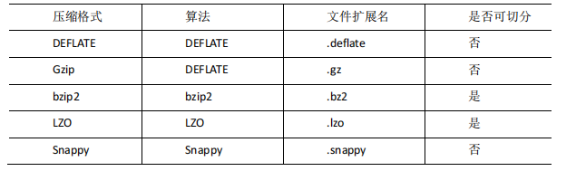

#### 2.文件存储格式

​	hive支持的存储数据格式主要有：textfile、sequencefile、orc、parquet

#### 3.总结

​	在实际的项目开发中，hive表的数据存储格式一般选择orc或parquet。压缩方式一般选择snappy，lzo

## 企业级调优

#### 1.执行计划

​	查看MR执行过程，执行job

```hive
hive (default)> explain [查询语句];
```

#### 2.fetch抓取

​	hive中对某些情况的查询可以不必使用MR计算。例如：select * from table;在这种情况下，hive可以简单地读取table对应的存储目录下的文件，然后输出结果到控制台

​	在hive-default.xml.template文件中hive.fetch.task.conversion默认是more，在全局查找、字段查找、limit查找等都不走MR

#### 3.本地模式

​	hive可以通过==本地模式==在单台机器上处理所有的任务。对于==小数据集==，执行时间可以明显被缩短。对于**大数据集**还是用**yarn**。

​	开启本地模式

```hive
set hive.exec.mode.local.auto=true;
```

#### 4.表的优化（Hive-SQL调优）

hive-sql调优一般是基于sql的执行顺序

（from>join>on>where>group by>having>select>distinct>order by>limit）

做优化处理，最大可能的缩小单表查询范围

##### 4.1小表大表join

​	将key相对分散，并且数据量小的表放在join的左边，可以使用map join 让小的维度表先进内存，在map端完成join

​	实测发现：新版的hive已经对小表join大表和大表join小表进行了优化。小表放在左边和右边已经没有区别

##### 4.2大表join大表

1. **空值过滤**

​	   有时join超时是因为key对应的数据太多，而相同key对应的数据都会发送到相同的reducer上，从而导致内存不够。此时我们应该仔细分析这些异常key，我们需要在SQL语句进行过滤，即先过滤再join，这样就可执行，并且执行速度加快

2. **空值转换**

   有时虽然某个key为空对应的数据很多，但是相应的数据不是异常数据，必须包含在join的结果中，此时我们可以将表中key为空的字段赋一个随机的值，使得数据均匀地分到不同的reducer上

> 数据倾斜：数据倾斜的根本原因是数据的key分布不均，个别key数据很多，超出了计算节点的计算能力的结果
>
> 过程：数据经过map后，由于不同的key的数据量分布不均，在shuffle阶段中通过partition将相同的key的数据发往同一个reducer，然后开始溢写写入磁盘，最后merge成最终的map阶段输出文件。如此一来，数据量很大的key将发往同一个reducer，超出了节点的计算能力
>
> **补充**:**不同数据类型关联产生数据倾斜**
>
> 场景：两表关联键的数据类型不一致，一个是int，另一个是string时，默认的Hash操作会按int型的id来进行分配，这样会导致所有string类型id的记录都分配到一个reducer
>
> 解决方法：把数字类型转换成字符串类型
>
> ```hive
> select * from table1 t1
> left join table2 t2
> on cast(t1.id as string) = t2.id;
> ```
>
> 

3. **分桶join（SMB(sort merge bucket join)）**

   (1)创建分桶表1，桶的个数不要超过可用CPU的核数

   ```hive
   create table bigtable_buck1(
   	id bigint,
       t bigint,
       uid string,
   	keyword string,
   	url_rank int,
   	click_num int,
   	click_url string
   )
   clustered by(id)
   sorted by(id)
   into 6 buckets
   row format delimited fields terminated by '\t';
   load data local inpath '/opt/module/data/bigdata' into table bigtable_buck1;
   ```

   (2)创建分桶表2，桶的个数不要超过可用CPU的核数

   ```hive
   create table bigtable_buck2(
   	id bigint,
   	t bigint,
   	uid string,
   	keyword string,
   	url_rank int,
   	click_num int,
   	click_url string
   )
   clustered by(id)
   sorted by(id) 
   into 6 buckets
   row format delimited fields terminated by '\t';
   load data local inpath '/opt/module/data/bigtable' into table 
   bigtable_buck2;
   ```

   (3)设置参数

   ```hive
   set hive.optimize.bucketmapjoin = true;
   set hive.optimize.bucketmapjoin.sortedmerge = true;
   set hive.input.format = org.apache.hadoop.hive.ql.io.BucketizedHiveInputFormat;
   ```

   (4)测试

   ```hive
   insert overwrite table jointable
   select b2.id,b2.t,b2.uid, b2.keyword, b2.url_rank, b2.click_num, b2.click_url
   from bigtable_buck1 b1
   join bigtable_buck2 b2
   on b2.id=b1.id;
   ```

##### 4.3 Group by

（1）是否在map端进行聚合，默认为true

```hive
set hive.map.aggr = true;
```

（2）在map端进行聚合操作的条目shumu

```hive
set hive.groupby.mapaggr.checkinterval = 100000;
```

（3）有数据倾斜的时候进行负载均衡（默认是false）

```hive
set hive.groupby.skewindata = true
```

​	当选项设为true，生成的查询计划会有两个MR job。第一个MR job中，map的输出结果会随机分布到reduce中，每个reduce做部分聚合操作，并输出结果，这样处理的结果是相同的Group by key 有可能会被分发到不同的reduce中，从而达到负载均衡的目的；第二个MR job再根据预处理的数据结果按照group by key分布到reduce中（这个过程可以保证相同的group by key被分布到同一个reduce中），最后完成最终的聚合操作。

##### 4.4 Count(Distinct)去重统计

​	数据量小的时候无所谓，数据量大的情况下，由于**count distinct操作需要用一个reduce task来完成**，这一个reduce需要处理的数据量太大，就会导致整个job很难完成，**一般count distinct使用先group by 再count的方式替换**，但是需要注意的是group by造成的数据倾斜

##### 4.5行列过滤

列处理：在select中，只拿需要的列，如果有分区，尽量使用分区过滤，少用select *

行处理：在分区剪裁中，当使用外连接时，如果将副表的过滤条件写在where后面，那么就会先全表关联，之后再过滤

（1）测试先关联两张表，再用where条件过滤

```hive
hive (default)> select o.id from bigtable b
                join bigtable o on o.id = b.id
                where o.id <= 10;
```

（2）通过子查询后，再关联表

```hive
hive (default)> select b.id from bigtable b
                join 
                (select id from bigtable where id <= 10)  
                o on b.id = o.id;
```

==注意==：其实经过底层优化（谓词下推），（1）（2）都是先过滤再关联，执行时间差不多，可以通过explain查看

##### 4.6合理设置map及reduce数

###### 4.6.1复杂文件增加map数

​	方法：根据computeSliteSize(Math.max(minSize,Math.min(maxSize,blocksize)))=blocksize=128M 公式，调整 maxSize 最大值。让 maxSize 最大值低于 blocksize 就可以增加 map 的个数。

###### 4.6.2小文件合并

​	在map执行前合并小文件，减少map数

```hive
set hive.input.format= 
org.apache.hadoop.hive.ql.io.CombineHiveInputFormat;
```

​	在map-reduce的任务结束时合并小文件的设置

​	（1）在map-only任务结束时合并小文件，默认为true

```hive
set hive.merge.mapfiles = true;
```

​	（2）在map-reduce任务结束时合并小文件，默认为false

```hive
set hive.merge.mapredfiles = true;
```

​	（3）合并文件大小，默认为256M

```hive
set hive.merge.size.per.task = 268435456;
```

​	（4）当输出文件的平均大小小于该值时，启动一个独立的map-reduce任务进行文件merge

```hive
set hive.merge.smallfiles.avgsize = 16777216;
```

###### 4.6.3合理设置reduce数

 1. 调整reduce个数方式一

    （1）每个reduce处理的数据默认值为256Mb

    ```hive
    hive.exec.reducers.bytes.per.reducer=25600000
    ```

    （2）每个任务最大的reduce数，默认是1009

    ```hive
    hive.exec.reducers.max=1009
    ```

    （3）计算reducer数的公式

    ```hive
    N=min(参数2，总输入数据量/参数1)
    ```

2. 调整reduce个数方法二

   在hadoop的mapred-default.xml文件中修改

   设置每个job的reduce个数

   ```hive
   set mapreduce.job.reduces = 15;
   ```

##### 4.7并行执行

​	默认情况下，hive一次只会执行一个阶段。不过，某个特定的job可能包含众多的阶段，而这些阶段可能并非完全互相依赖的，也就是说有些阶段是可以并行执行的，这样可能使得整个job的执行时间缩短。

​	通过设置参数hive.exec.parallel值为true，就可以开启并发执行。不过，在共享集群中，需要注意下，如果job中并行阶段增多，那么集群利用率就会增加

```hive
set hive.exec.parallel=true;  //打开任务并行执行
set hive.exec.parallel.thread.number=8;  //同一个sql允许最大并行度，默认为8
```

##### 4.8分区、分桶、压缩

##### 4.9JVM重用
