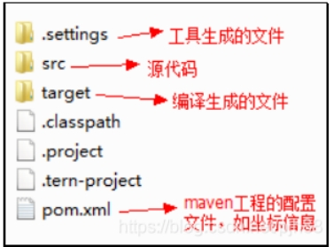

# 1. **什么是maven？**

Maven是一个项目管理工具，它包含了一个对象模型，一组标准集合，一个依赖管理系统。

能通过pom.xml文件的配置获取jar包而不用手动的添加jar包，即maven提供了一些功能，方便Java项目和web项目使用

# 2. **maven解决什么问题**

\1. 构建工程

\2. 管理jar包

\3. 编译代码

\4. 自动运行单元测试

\5. 打包

\6. 生成报表

\7. 部署项目

# 3. **maven的依赖管理**

Maven的核心特征就是依赖管理（就是一个管理jar包的过程），通过pom.xml中添加所需的jar包的坐标，这样避免了jar包直接引入进来，在需要用到jar包的时候，只要查找pom.xml文件，再通过pom.xml中的坐标，到一个专门存放jar包的仓库中根据坐标从而找到这些jar包，再把这些jar包拿去运行

# 4. **仓库的概念**

仓库就是存放jar包的地方，即我们前面说的通过pom.xml中通过设置索引来到仓库中寻找jar包。仓库分为：本地仓库，第三方仓库，中央仓库

获取jar包过程：优先从本地仓库查找，如果本地仓库没有该jar包，就从第三方仓库（私服）中查找，如果还是没有，就从中央仓库查找，然后下载到本地仓库，下次使用就可以直接从本地仓库中查找，没有配置第三方仓库，直接从中央仓库查找

# 5. **Maven Java项目管理**

 

# 6. **maven常用命令**

\1. compile是编译命令，作用是将src/main/java下的文件编译为class文件输出到target目录下

\2. Test test是工程测试命令，会执行src/test/java下的单元测试类

\3. Clean clean是工程的清理命令，执行clean会删除target目录及其内容

\4. Package package是工程的打包命令，对于Java工程执行package打成jar包，对于web工程打成war包

\5. Install install是工程的安装命令，执行install将maven打成jar包或war包发布到本地仓库

# **7.maven的生命周期**

 

# **8.中央仓库的官网**

 http://search.maven.org/ 

http://mvnrepository.com/
